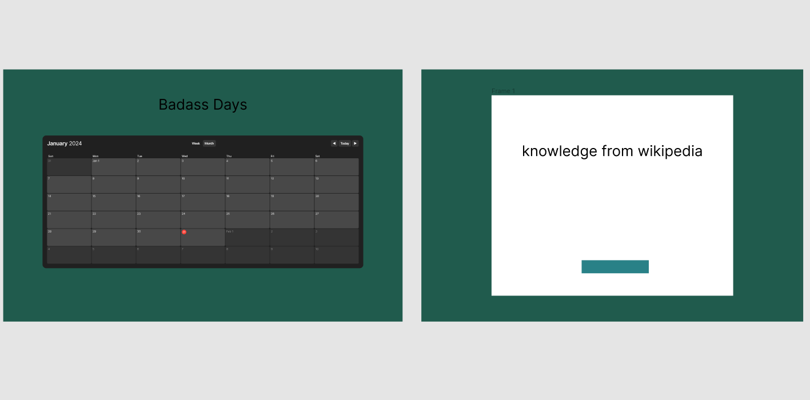

# Badass Days
is a web application that displays a calendar with special days, allowing users to explore relevant Wikipedia knowledge for each specific day.

## Screenshots

## Table of Contents
- [Features](#features)
- [APIs](#apis)

## Features
- Calendar view with special days marked
- Wikipedia knowledge pop-up for selected days
- Responsive design for optimal user experience on various devices

## APIs
### Calendarific API
To show special days

### Wikipedia API
To show information about special days
