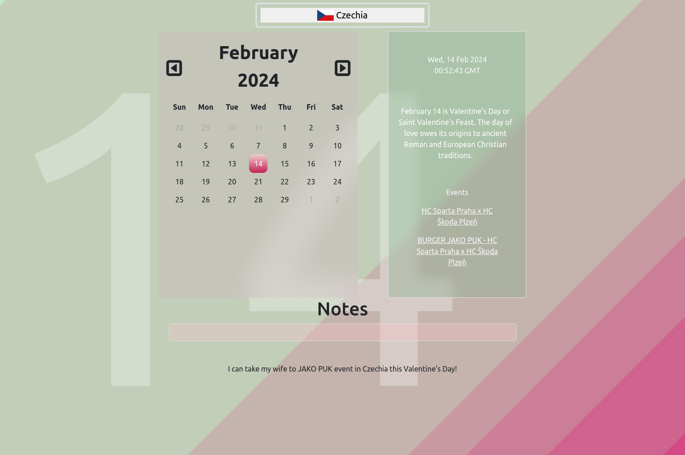

# Event Listener

## Description

Event Listener is a web application that displays a calendar with special holidays and events, allowing users to explore and plan for holidays or trips, whether abroad or local. for each specific day if a holiday for the selected country matches that date, a brief description is displayed to the right of the calendar, along with recommended attractions. Additionally, a note taking functionality allows the user to record memories and plans on their journies.

## Table of Contents

- [Description](#description)
- [Deployed Application](#deployed-application)
- [Screenshots](#screenshots)
- [Features](#features)
- [APIs](#apis)

## Deployed Application

https://mdtoy-dev.github.io/travelersDiary/

## Screenshots

### Calendar Overview

### Country Selection

## Features

- Calendar view
- Holiday descriptions for selected day and location (when appropriate)
- Various attractions displayed for selected day and location (when appropriate)
- Responsive design for optimal user experience on various devices
- Minimalistic and sleek design
- Note taking functionality

## APIs

### Calendarific API

To show country specific holidays

[Calendarific API Documentation](https://calendarific.com/api-documentation)

### Ticket Master API

To add events the user might be interested in booking tickets for to the calendar.

[Ticket Master API Documentation](https://developer.ticketmaster.com/products-and-docs/apis/discovery-api/v2/)
